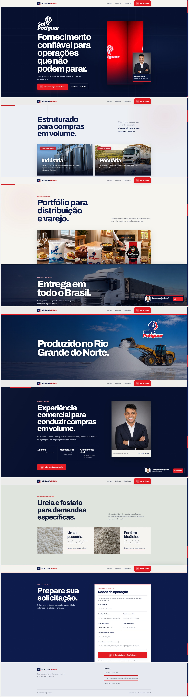
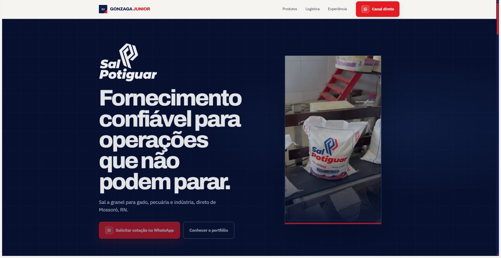
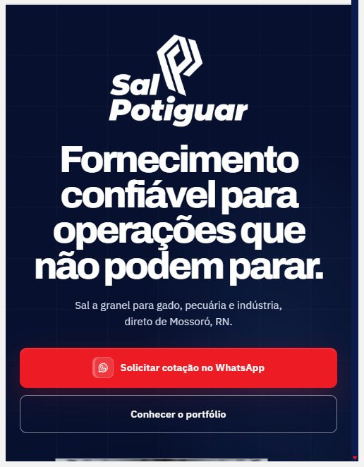
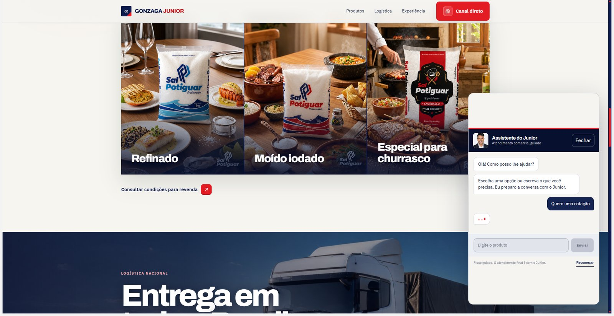

# Sal Potiguar — Site de Captação B2B

Site de captação de leads B2B para o Gonzaga Junior, representante comercial da linha **Sal Potiguar** (sal a granel para gado, pecuária e indústria), com ureia e fosfato sob consulta. Vanilla HTML/CSS/JS, zero framework, mobile-first, publicado na Vercel.

**🔗 Site no ar:** [gonzagajuniorsalpotiguar.com](https://gonzagajuniorsalpotiguar.com/)

> Este repositório é uma vitrine pública do front-end. O repositório operacional (com integração de Google Ads, tracking de conversão e documentação de estratégia comercial) é privado.

---

## Screenshots

Página inteira, do hero ao rodapé:



Detalhes:

<table>
<tr>
<td width="60%"></td>
<td width="40%"></td>
</tr>
<tr>
<td colspan="2"></td>
</tr>
</table>

---

## Destaques visuais e de interação

- **Vídeo real da operação no hero**, com playlist e troca automática de clipe ao terminar (sem stock footage).
- **Parallax nativo com fallback**: usa `animation-timeline: view()` (CSS scroll-driven animations) quando o navegador suporta, e cai para parallax via `IntersectionObserver` + `requestAnimationFrame` quando não suporta — sem lib externa.
- **Reveal on scroll** progressivo por seção, com atraso escalonado por elemento.
- **Assistente de vendas guiado** (chatbot próprio, sem LLM): árvore de intenção por regex + captura de slots (produto, perfil, volume, destino), qualifica o lead antes de abrir o WhatsApp e nunca revela preço.
- **Handoff de WhatsApp com transição animada** (`whatsapp.html`), preservando UTM/atribuição de campanha na mensagem.
- **Tracking de conversão dedicado** (`assets/tracking.js`): dedupe de conversão por sessão, `transaction_id` único, qualificação client-side de volume comercial (tonelada/kg/sacaria/carga fechada) antes de disparar o evento de conversão do Google Ads.

## Stack

HTML5 · CSS3 (scroll-driven animations nativas, sem framework) · JavaScript vanilla (ES5-compatível, sem build step) · Google Ads (gtag.js) · Vercel (deploy contínuo)

## Estrutura

```
index.html                    home
whatsapp.html                 página de transição do handoff pro WhatsApp
assets/
  atendimento-guiado.js       chatbot de qualificação de lead
  tracking.js                 tracking de conversão e atribuição
  whatsapp-handoff.js/css     transição animada pro WhatsApp
  editorial-v2.css            estilos
  *.webp, *.mp4, *.svg        mídia (imagens, vídeos, ícones)
```
